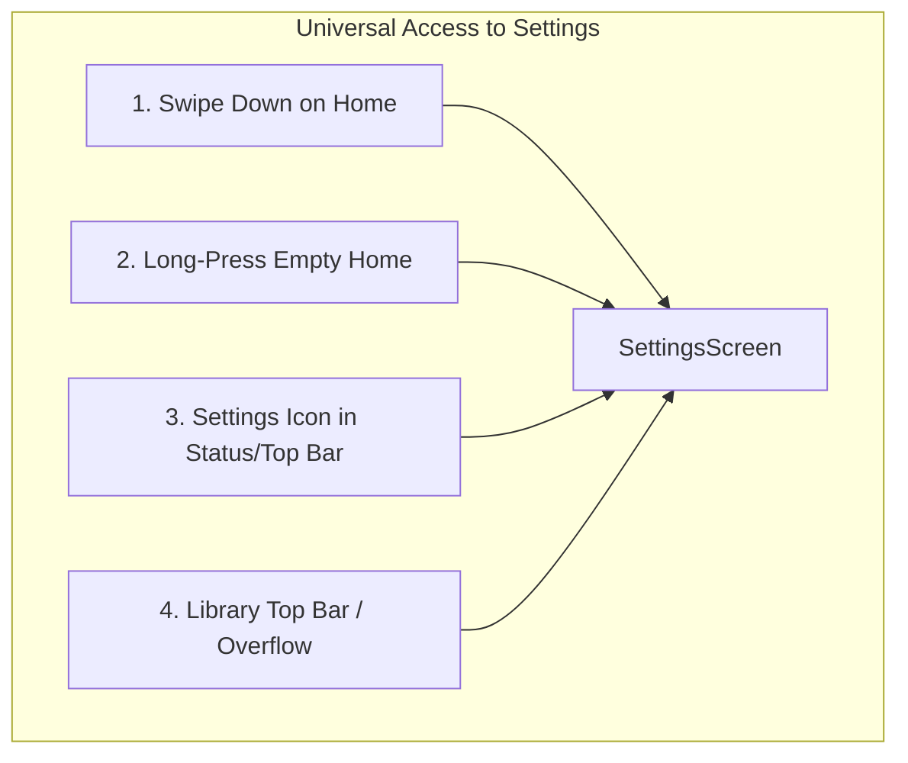

# Book Launcher: World-Class UI/UX, Habit Formation & Accessibility Masterplan

## Goal Description

Transform **Book Launcher** from a functional, well-architected minimalist launcher into an **intuitive, habit-forming, and viral mobile phenomenon**.

Hardware-in-the-loop testing on a physical Android device (**Samsung Galaxy M42 5G**, Android 13) confirmed that the foundational engineering is exceptionally strong:
- Zero external runtime dependencies (ultra-lightweight, instantaneous startup)
- Custom reflow typography, hyphenation, and StaticLayout pagination
- Built-in OPDS client for Project Gutenberg and Standard Ebooks
- Instantaneous activity resumption

However, practical real-device testing revealed critical UI/UX shortcomings, starting with a severe **settings discoverability flaw**, followed by habit-formation and viral growth bottlenecks:

```
Critical UX Flaws Identified on Hardware:
1. Settings Trap: Settings is buried inside the 174-app grid; unreachable from Home, Library, or Reader.
2. Cold-Start Abandonment: Blank "Nothing on your shelf" screen forces a 7-step OPDS download funnel.
3. Ergonomic Mismatch: Giant raw excerpt pushes "Continue Reading" down past comfortable thumb reach.
4. Intimidation Metric: Showing "Page 385 / 1976" triggers reading fatigue instead of bite-sized velocity.
5. Missing Viral Engine: Zero shareability, zero aesthetic quote export for social loops.
```

---

## User Review Required

> [!IMPORTANT]
> **Priority Decisions for Review:**
> 1. **Settings Accessibility (Multi-Point Access):**
>    - **Swipe Down on Home:** The natural Android gesture (currently unused in `GestureFrame`) opens Settings instantly.
>    - **Home Long-Press:** Long-pressing empty space on Home opens Settings (standard Android launcher convention).
>    - **Visible Top/Bottom Touchpoints:** Add Settings entry to the Home status bar and Library screen top bar.
> 2. **Zero-State Onboarding ("Instant Starter Pack"):** Bundle or 1-tap stream 3-4 public domain starter classics during setup so the user never lands on an empty screen.
> 3. **The Mindful Escape Hatch ("The 1-Sec Friction Screen"):** Optional 2-second breathing pause before the 174-app grid slides open.
> 4. **Aesthetic Quote Cards:** Exportable 9:16 / 16:9 quote cards formatted for Instagram Stories / X to drive organic K-factor growth.

---

## 1. Top Priority: Universal Settings Accessibility

### The Problem
During testing, we discovered that **Settings is only reachable from a single screen in the entire app**: the tiny gear icon at the top right of `AppsScreen.kt`.
- On **HomeScreen**: Tapping the top status bar only toggles Color/Black ink on long-press. There is zero visible or gesture path to Settings.
- On **LibraryScreen**: The top bar only has `+ Add`. There is no Settings entry.
- On **ReaderActivity**: The Aa menu only has font/theme toggles; no path to general app settings.
- If a user wants to configure book folders, change ink, manage pinned apps, or switch launchers, they are forced to open the app drawer first. For a minimalist launcher designed to *steer you away* from the app drawer, hiding system settings inside it is a fundamental UX contradiction.

### The Solution: 4-Way Settings Accessibility



1. **Swipe Down on Home (`onSwipeDown` in `GestureFrame`):**
   - Standard Android convention across Pixel, OneUI, and Nova Launcher.
   - Currently, `GestureFrame.kt` only listens for `onSwipeUp` (Apps) and `onSwipeRight` (Library). Adding `onSwipeDown = { host.push(SettingsScreen(host)) }` provides an effortless, physical gesture.
2. **Long-Press on Empty Home Space:**
   - In `HomeScreen.kt`, bind `setOnLongClickListener` on the root frame or empty area to launch `SettingsScreen(host)`.
3. **Top Bar Touchpoint on Home:**
   - Add a subtle, elegant Settings gear or three-dot glyph in the top right of Home's status bar (or make tapping the status bar open a quick menu: Ink Toggle / Settings).
4. **Library Top Bar Entry:**
   - On `LibraryScreen.kt`, add a gear icon in `topBar("Library", "", rightIcon = R.drawable.ic_settings)`.

---

## 2. Zero-Friction Onboarding: "The Instant Starter Pack"

### The Problem
- After clean install, the user sees: `"Nothing on your shelf yet"` + an `"Add Books"` button.
- To read anything, they must discover: `Add Books → Free Catalogs → Gutenberg → Popular → Select Book → Download EPUB → Open`.
- Every additional step in a mobile onboarding funnel cuts conversion by 20–30%.

### The Solution
- In `SetupScreen` Step 2 ("Add your books"), offer two distinct paths:
  1. **Pick a Starter Classic (Instant):** Curated shelf of 4 titles with covers (*Meditations*, *The Great Gatsby*, *Sherlock Holmes*, *Pride & Prejudice*).
  2. **Import My Own Files (Folder / Files picker).**
- Choosing a starter classic downloads/extracts it immediately so the user lands on Home with **Page 1 already waiting**.

---

## 3. Thumb-First Ergonomics & Home Visual Hierarchy

### The Problem
- The excerpt on Home takes 7–8 lines of 20sp text, pushing the book cover, title, progress bar, and "CONTINUE READING" button down to Y=1000px+.
- The button is pushed below the natural ergonomic zone for one-handed thumb use on modern 20:9 screens.

### The Solution
- **Atmospheric Pull-Quote:** Cap the excerpt at 2–3 italicized lines with clean opening quotation marks.
- **Hero Book Cover:** Increase cover size from 56dp to 110dp with a realistic subtle spine edge and drop-shadow styling.
- **Anchored Thumb Bar:** Anchor `CONTINUE READING` directly above the bottom navigation bar (48dp height, full width minus 36dp margins) in the physical "sweet spot" of the thumb.

---

## 4. Habit-Forming Dopamine Loops: Velocity & Streaks

### The Problem
- Displaying `P. 385/1976 · 18%` induces cognitive fatigue. A 2,000-page book feels impossible to pick up during a 5-minute coffee break.
- No streak tracking or session feedback exists.

### The Solution
- **Kindle-Style Velocity ("Minutes Left in Chapter"):** Measure user WPM from page-turn timestamps. Replace page count with: **`11 mins left in Chapter 22`**. This makes reading feel bite-sized and actionable.
- **Daily Streak Counter:** Minimalist flame/book badge on Home: `5-Day Streak · 14 mins today`.
- **Chapter Completion Interlude:** Brief, quiet celebratory card when finishing a chapter: *"Chapter 22 Complete · 4 chapters read this week"*.

---

## 5. The Mindful Escape Hatch: Friction on the App Grid

### The Problem
- PRD Premise: *"Remove the app grid as the reflexive escape hatch."*
- Reality on phone: Swiping up instantly slides open all 174 apps with zero friction, allowing old muscle memory to take over.

### The Solution ("The 2-Page Barrier")
- Optional toggle in Settings: **"Mindful Pause before Apps"**.
- Swiping up displays a tranquil 2-second interstitial:
  > *"Read 1 page first? Or continue to Apps (2s)"*
- Cures mindless phone unlocking and redirects attention to the active book.

---

## 6. Viral K-Factor Engine: Aesthetic Quote Cards

### The Problem
- Zero native shareability or organic growth loop.

### The Solution
- Long-press text selection in `PageView.kt` triggers a minimalist action bar: `[ Highlight ]` `[ Copy ]` `[ Share Quote Card ]`.
- `Share Quote Card` renders an off-screen 1080x1920 canvas:
  - Penguin Classics / Faber & Faber editorial typography
  - Selected quote in custom serif font with quotation marks
  - Book title & author
  - Elegant footer watermark: *"Read on Book Launcher"*
- Directly launches system share sheet (Instagram Stories, X, WhatsApp, Threads).

---

## Technical File Change Plan

### 1. Settings Menu Discoverability
- **`[MODIFY]` `app/booklauncher/ui/GestureFrame.kt`**
  - Add `var onSwipeDown: (() -> Unit)? = null`.
  - Detect downward vertical swipe gesture and dispatch callback.
- **`[MODIFY]` `app/booklauncher/ui/HomeScreen.kt`**
  - Set `frame.onSwipeDown = { host.push(SettingsScreen(host)) }`.
  - Bind empty area long-press to open Settings.
  - Add Settings gear icon or status-bar tap action for Settings.
- **`[MODIFY]` `app/booklauncher/ui/LibraryScreen.kt`**
  - Add Settings icon to `topBar` so users in the library can reach Settings directly.

### 2. Onboarding & Starter Classics
- **`[MODIFY]` `app/booklauncher/ui/SettingsScreen.kt` (`SetupScreen`)**
  - Add 1-tap Starter Classic carousel in Step 2 of setup.

### 3. Home Ergonomics & Velocity
- **`[MODIFY]` `app/booklauncher/ui/HomeScreen.kt`**
  - Refactor `nowReading()`: larger 110dp cover, 2-3 line pull quote, bottom-anchored Continue button.
  - Add "X mins left in chapter" and streak badge.
- **`[MODIFY]` `app/booklauncher/reader/ReaderActivity.kt`**
  - Track user reading speed (WPM) and calculate chapter ETA.

### 4. Viral Quote Cards
- **`[NEW]` `app/booklauncher/ui/QuoteCardExport.kt`**
  - Off-screen Canvas renderer and `Intent.ACTION_SEND` integration.

---

## 7. Format Support: TXT vs. PDF Formatting Capabilities

### Plain Text (`.txt`)
- **Already fully supported with 100% EPUB formatting parity.**
- `TextBook.kt` parses text into paragraphs and headings, returning a `FlowBook`.
- TXT files support: font sizing (`− 18 +`), serif vs. sans selection, margin sizes (S/M/L/XL), color ink vs. black ink, all page palettes (`Default`, `White`, `Paper`, `Sepia`, `Mist`, `Night`), and textures.

### PDF Documents (`.pdf`)
- PDFs are **fixed-layout vector/raster files** rendered via Android's `PdfRenderer` into bitmaps; individual fonts and margins cannot be reflowed without heavy external C++ engines.
- **Proposed PDF Enhancement Suite (Zero-Dependency):**
  1. **Night Mode Invert & Sepia Tint:** Apply hardware `ColorMatrixColorFilter` to the rendered PDF bitmap so Night Mode turns blinding white pages into warm dark pages (`#191814` with ivory text).
  2. **Fit Width vs. Fit Page:** Allow zooming into text columns on narrow phone screens.
  3. **Auto Margin Trimming:** Crop blank print margins to increase text size by 30-40%.
  4. **Contrast Boost:** Stepper to darken washed-out or scanned academic text.
  5. **Landscape Mode:** 1-tap rotation lock for wide-format and two-column reading.

---

## 8. Reader Utilities: Highlighting & In-App Dictionary

### 1. Highlighting Engine (Reflow-Safe & E-Ink Ready)
- **Character Offset Coordinates:** Highlights are anchored by `(chapterIndex, startOffset, endOffset)`. Because offsets represent character positions in the text stream, **highlights never break or drift when font size, margin, or orientation change**.
- **Adaptive Canvas Rendering in `PageView.onDraw()`:**
  - **Color Ink:** Soft watercolor highlighter wash (`#40F2C94C` on paper, `#4DFFD166` on night mode).
  - **Black Ink (E-Ink):** Crisp 1.5dp underline below words to prevent ghosting and retain 100% black/white sharpness.
- **Highlights & Notes Notebook:** Aa menu section listing all saved passages with 1-tap jump to page.

### 2. In-App & System Dictionary Lookup
- **Text Hit Detection:** Long-press mapped to character offset using `StaticLayout.getLineForVertical` and `getOffsetForHorizontal`.
- **Floating Selection Bar:** `[ Highlight ]` `[ Define 📖 ]` `[ Copy ]` `[ Quote Card 🎴 ]`.
- **In-App Definition Sheet:** Minimalist typography sheet displaying phonetic pronunciation, part of speech, and concise definitions (via free Wiktionary/dictionary API + LRU cache).
- **Offline System Integration:** Fires Android `ACTION_PROCESS_TEXT` and `ACTION_DEFINE` to support offline dictionary apps (ColorDict, GoldenDict, WordWeb, Google Translate).

---

## Verification Plan

### Automated Tests
- Run `./gradlew.bat test` to verify all unit tests pass with zero regressions.

### Manual Device Verification (SM-M426B)
1. **Swipe Down on Home:** Swipe down from anywhere on Home screen -> verify Settings opens smoothly.
2. **Long-Press on Home:** Long press empty space on Home -> verify Settings opens.
3. **Library Settings Access:** Verify Settings icon exists in Library top bar and opens cleanly.
4. **Thumb Reach:** Verify `Continue Reading` is immediately tappable without adjusting hand grip.
5. **Starter Onboarding:** Clear data, verify 1-tap classic selection on cold start.
