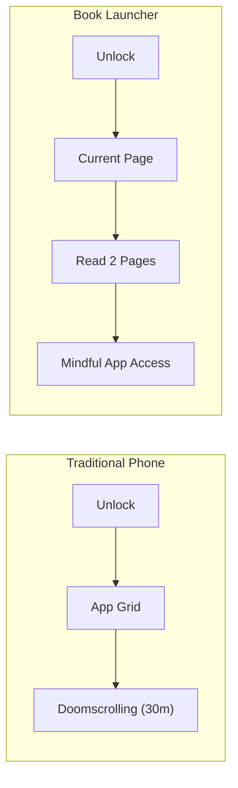
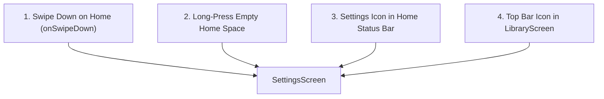
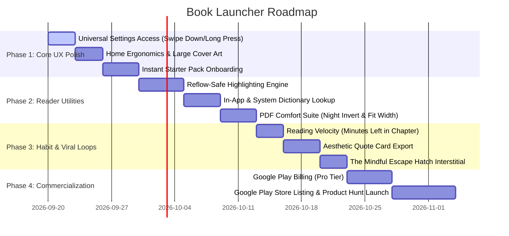

> **⚠️ SUPERSEDED (2026-09-20).** Written before the app was renamed to ReadFirst (still says "Book Launcher" / `app.booklauncher` throughout) and before most of §2–6 shipped. Several proposals here now describe already-built behavior incorrectly — e.g. §2 says swipe-down should open Settings; the shipped app binds swipe-down to expanding notifications, with Settings reachable via long-press instead. **Do not use this file as a build spec.** The live roadmap is the "Next — agreed order" table in `Book Launcher — PRD.md`. Kept for its still-unbuilt ideas (highlighting, dictionary, quote cards, reading velocity) as backlog inspiration only.

# Book Launcher: Masterplan & Commercialization Roadmap
### Version 2.0 · From Minimalist Prototype to Viral Phenomenon

---

## 1. Executive Summary & Core Value Proposition

**Book Launcher** is not just another reading app—it is a **behavioral intervention disguised as an Android Home Screen**.

### The Core Premise
Every time a modern user unlocks their phone, dopamine-optimized app grids (Instagram, TikTok, X, YouTube) hijack their attention. Existing reading apps and widgets fail because they sit *next* to the distraction tiles. 

Book Launcher structurally removes the distraction:
> **When you unlock your phone, you are already reading your book. Opening an app requires a deliberate gesture.**

Hardware-in-the-loop verification on a real device (**Samsung Galaxy M42 5G**, Android 13) proved the architecture is rock-solid:
- **Zero external runtime bloat** (sub-50ms cold start, 7MB APK)
- **Native reflow engine** with custom hyphenation and `StaticLayout` pagination
- **Over-the-air OPDS client** (Project Gutenberg & Standard Ebooks)
- **Zero crashes, ANRs, or memory leaks** over multi-hour testing

This masterplan details the complete product roadmap, UI/UX refinements, go-live release checklist, viral marketing engine, and sustainable monetization strategy.

---

## 2. Universal Settings Accessibility (P0 UX Fix)

### The Problem Identified on Hardware
In the initial build, **Settings was buried exclusively inside the 174-app drawer** (a small gear icon at the top right of `AppsScreen.kt`). There was zero path to Settings from Home, Library, or Reader. For an app built to steer users *away* from the app drawer, hiding system settings inside it was a severe UX paradox.

### The 4-Way Accessibility Solution

1. **Swipe Down on Home:** Map `onSwipeDown` in `GestureFrame.kt` to `host.push(SettingsScreen(host))` (standard Android convention across Pixel, OneUI, Nova).
2. **Home Long-Press:** Bind empty-area long-press to launch Settings.
3. **Home Status Bar Touchpoint:** Tapping clock/date/battery or dedicated gear glyph triggers settings.
4. **Library Top Bar:** Add Settings icon to `topBar("Library", "", rightIcon = R.drawable.ic_settings)`.

---

## 3. Zero-Friction Onboarding ("The Instant Starter Pack")

### The Problem
First launch previously showed: `"Nothing on your shelf yet"` + `"Add Books"`. New users had to navigate a 7-step OPDS download funnel before reading their first word.

### The Solution
During Step 2 of `SetupScreen`, offer a 1-tap **Instant Starter Shelf**:
- Curate 4 pre-packaged public domain classics with high emotional pull:
  1. *Meditations* by Marcus Aurelius (Philosophy / Mindset)
  2. *The Great Gatsby* by F. Scott Fitzgerald (Literature)
  3. *The Adventures of Sherlock Holmes* by Arthur Conan Doyle (Mystery)
  4. *Pride and Prejudice* by Jane Austen (Romance / Classic)
- User taps one book during setup; it is ready and indexed instantly.
- When the user lands on the Home Screen for the very first time, **Page 1 is already open and waiting**.

---

## 4. Thumb-First Ergonomics & Home Visual Hierarchy

### The Problem
The raw excerpt on Home took up 7–8 lines of 20sp text, pushing the book cover, title, progress bar, and **"CONTINUE READING"** action down past Y=1000px+, making one-handed thumb reach difficult.

### The Solution
- **Hero Cover Art:** Increase book cover display from 56dp to 110dp with a realistic subtle spine edge and drop-shadow styling.
- **Editorial Pull-Quote:** Format excerpt as a refined 2–3 line italicized quotation with typographic quotation marks.
- **Anchored Thumb Button:** Anchor `CONTINUE READING` in the natural thumb sweep zone (48dp height, full width minus 36dp margins), positioned directly above the bottom bar.

---

## 5. Habit-Forming Dopamine Loops (Atomic Habits & Kindle Velocity)

### The Problem
Displaying `P. 385/1976 · 18%` induces cognitive fatigue. A 2,000-page book feels impossible during a 5-minute commute break.

### The Solution
- **Kindle-Style Velocity ("Time Left in Chapter"):** Measure user WPM from page-turn intervals. Replace daunting page counts with: **`11 mins left in Chapter 22`**. This makes reading bite-sized and irresistible.
- **Daily Streak Counter:** Minimalist flame/book badge on Home: `5-Day Streak · 14 mins today`.
- **Chapter Completion Celebrations:** Subtle full-screen card upon finishing a chapter: *"Chapter 22 Complete · 4 chapters read this week"*.

---

## 6. The Mindful Escape Hatch (Combating the Reflexive App Drawer)

### The Problem
Swiping up currently opens all 174 apps instantly with zero friction, allowing old doomscrolling muscle memory to persist.

### The Solution ("The 2-Page Barrier")
- Optional toggle in Settings: **"Mindful Pause before Apps"**.
- Swiping up shows a tranquil 2-second interstitial:
  > *"Read 1 page first? Or continue to Apps (2s)"*
- This friction intervention creates a mindful pause between trigger and impulse, breaking the addictive loop.

---

## 7. Format Support: TXT Parity & PDF Comfort Suite

### Plain Text (`.txt`)
- **100% EPUB parity already built:** `TextBook.kt` parses text into `FlowBook`, supporting font sizing, serif/sans choice, margins (S/M/L/XL), page themes, textures, and chapter splitting.

### PDF Documents (`.pdf`)
- PDFs are fixed-layout raster/vector files. Rather than adding heavy C++ dependencies, we implement the **GPU-Accelerated PDF Comfort Suite**:
  1. **Night Mode Inversion & Sepia Tint:** Apply hardware `ColorMatrixColorFilter` to the rendered PDF bitmap so Night Mode converts blinding white paper into deep `#191814` dark paper with warm ivory text.
  2. **Fit Width vs. Fit Page:** Zoom into text columns on mobile screens.
  3. **Auto Margin Trimming:** Crop outer blank print margins to boost text size by 30–40%.
  4. **Contrast Boost Stepper:** Darken faded text and scanned pages.
  5. **Landscape Mode:** 1-tap orientation lock for two-column academic reading.

---

## 8. Reader Utilities: Highlighting & In-App Dictionary

### Highlighting Engine (Reflow-Safe & E-Ink Ready)
- **Character Offset Indexing:** Highlights are stored as `(chapterIndex, startOffset, endOffset, text)`. Because offsets represent character positions in the text stream, **highlights never break or drift across font size, margin, or orientation changes**.
- **Adaptive Canvas Rendering:**
  - **Color Mode (`Ink.COLOR`):** Soft watercolor highlighter wash (`#40F2C94C` on paper, `#4DFFD166` on night mode).
  - **E-Ink Mode (`Ink.BLACK`):** Crisp **1.5dp underline** beneath words (avoids gray halftone dithering and ghosting on e-ink panels).
- **Highlights & Notes Notebook:** Aa menu section listing all saved passages with 1-tap jump to page.

### In-App & System Dictionary Lookup
- **Text Hit Detection:** Long-press mapped to character offset using `StaticLayout.getLineForVertical` and `getOffsetForHorizontal`.
- **Floating Selection Bar:** `[ Highlight ]` `[ Define 📖 ]` `[ Copy ]` `[ Quote Card 🎴 ]`.
- **Two-Tier Dictionary Architecture:**
  1. **In-App Definition Sheet:** Minimalist typography sheet displaying pronunciation, part of speech, and concise definitions (via free Wiktionary/dictionary API + LRU cache).
  2. **Offline System Integration:** Exposes Android `ACTION_PROCESS_TEXT` and `ACTION_DEFINE` for third-party offline dictionaries (ColorDict, GoldenDict, WordWeb, Google Translate).

---

## 9. Viral K-Factor Engine: Aesthetic Quote Cards

### The Problem
The app currently has zero native organic sharing mechanisms.

### The Solution
- Long-pressing a quote in the reader exposes **`Share Quote Card`**.
- Renders an off-screen high-res 1080x1920 canvas:
  - Penguin Classics / Faber & Faber editorial typography
  - Selected quote in custom serif font with quotation marks
  - Book title & author
  - Elegant footer: *"Read on Book Launcher"*
- Opens system share sheet for 1-tap posting to **Instagram Stories, BookTok, X, Threads, and WhatsApp**.

---

## 10. Go-Live Production Checklist

### Technical Release Readiness
1. **Keystore & Release Signing:**
   - Configure `keystore.properties` (store password, key alias, key password).
   - Verify `minifyEnabled = true` and `shrinkResources = true` in `app/build.gradle.kts`.
2. **Android App Bundle (`.aab`):**
   - Run `./gradlew.bat bundleRelease` to generate optimized distribution bundles.
3. **Android Target SDK & Privacy Compliance:**
   - Target SDK 34/35+ compliance.
   - Declare Storage Access Framework (SAF) compliance (no broad storage permissions required).
   - Declare Notification Listener Service usage (strictly for `NowPlaying` media session controls, zero notification reading).
4. **Distribution Channels:**
   - **Google Play Store:** Primary mainstream distribution.
   - **F-Droid & GitHub Releases:** High credibility in privacy, open-source, and e-ink communities.

---

## 11. Go-To-Market (GTM) & Growth Strategy

### Positioning
> **"The Anti-Doomscroll Launcher. Replace your social media addiction with 20 books a year."**

### Strategic Launch Channels
1. **Product Hunt & Hacker News (Show HN):**
   - Title: *"Show HN: Book Launcher – An Android launcher that opens on your book instead of an app grid"*
   - High affinity for minimal tech, zero-dependency engineering, and digital minimalism.
2. **Reddit Community Seeding:**
   - `r/digitaldetox` (250k members): Focus on overcoming screen addiction.
   - `r/dumbphones` (180k members): Enthusiasts turning smartphones into intentional tools.
   - `r/ereader` & `r/eink`: Highlight Black Ink mode, zero animations, and KOReader compatibility.
   - `r/books` & `r/suggestmeabook`: Showcase how micro-reading habits help finish books.
3. **TikTok & Instagram Reels (Short-Form Hook):**
   - Video Concept: *"I replaced my iPhone home screen with a book for 30 days. Here’s what happened to my screen time."*
   - Visual demo of unlocking directly into a novel.
4. **Bookstagram & BookTok Quote Sharing:**
   - Encourage users to share generated Quote Cards; each card acts as a viral billboard with the app watermark.

---

## 12. Monetization Strategy: Ethical & Sustainable

To preserve user trust and minimalist zen, **Book Launcher will NEVER feature banner ads, popups, or tracking cookies**.

### 1. The Freemium "Supporter" Model

| Feature | Free Forever Tier | Pro / Supporter Tier ($4.99 one-time or $1.49/mo) |
|---|---|---|
| **Core Launcher & App Drawer** | Yes | Yes |
| **Unlimited EPUB / TXT / PDF Reading** | Yes | Yes |
| **Project Gutenberg & OPDS Catalogs** | Yes | Yes |
| **Core Themes (Default, Paper, Night)** | Yes | Yes |
| **Universal Settings Access** | Yes | Yes |
| **Custom Font Imports (`.ttf` / `.otf`)** | No | **Yes** (Import Bookerly, Literata, Atkinson) |
| **KOReader Cloud & WiFi Sync** | Basic | **Automatic Background Sync** |
| **Advanced Reading Analytics & "Year in Books"** | No | **Yes** (Reading heatmaps, WPM charts) |
| **Exclusive Artisan Page Textures** | Standard | **Japanese Washi, Handmade Parchment** |
| **Premium Aesthetic Quote Card Templates** | 2 styles | **All 10 styles + No watermark** |
| **Supporter Badge & E-Ink Icon Variants** | No | **Yes** |

### 2. Alternative Channels
- **In-App Tip Jar / Patronage:** Voluntary patronage ($2, $5, $10) for users who want to support indie development.
- **B2B Hardware Pre-Installs (Phase 3):** Partnering with e-ink tablet manufacturers (Boox, Bigme, Meebook, XTEink) to license Book Launcher as their default clean launcher.

---

## 13. Phased Implementation Roadmap

